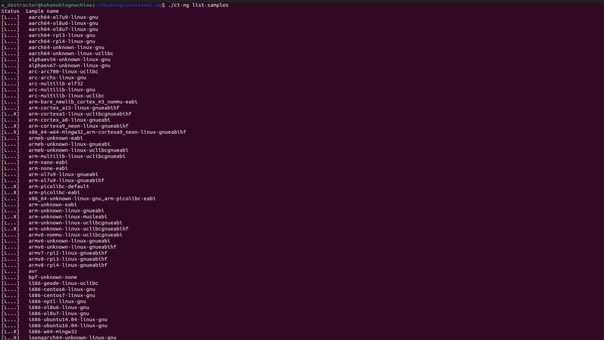
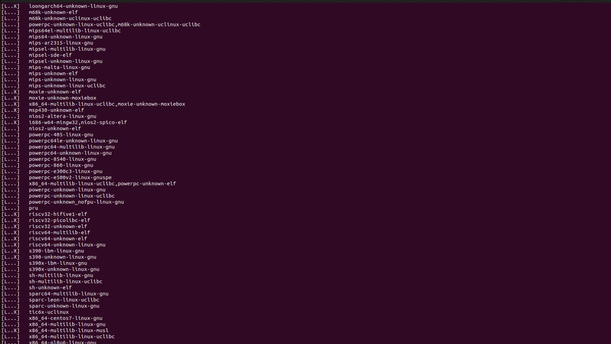
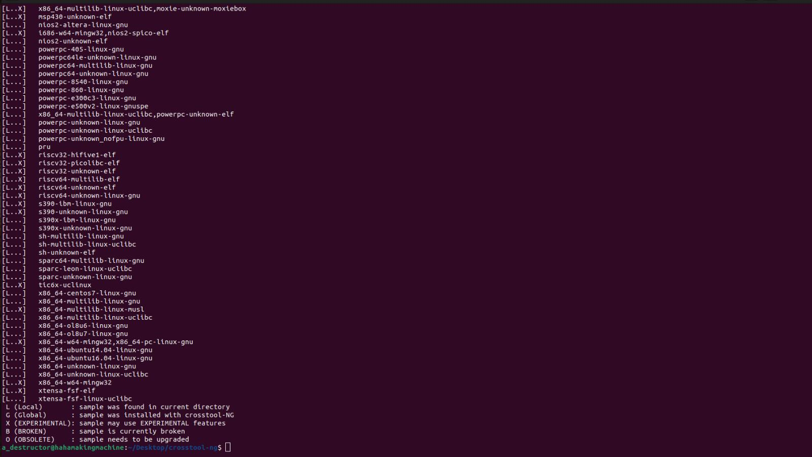
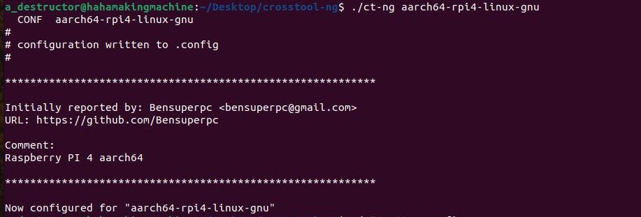
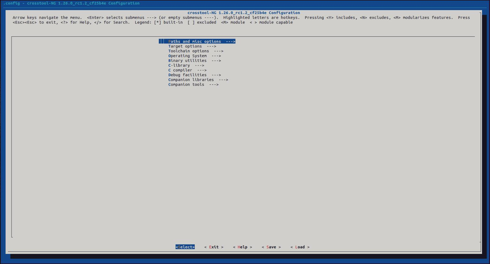
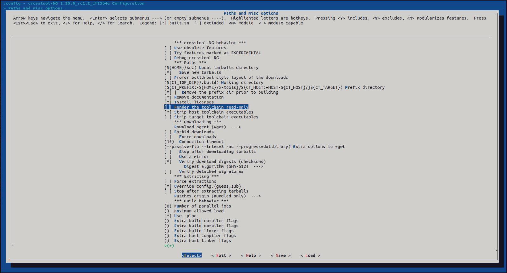
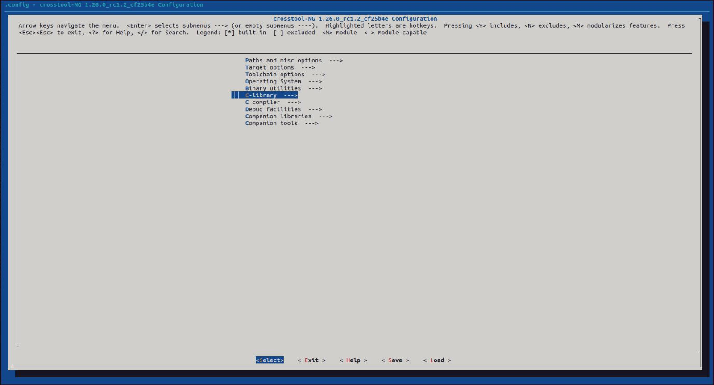
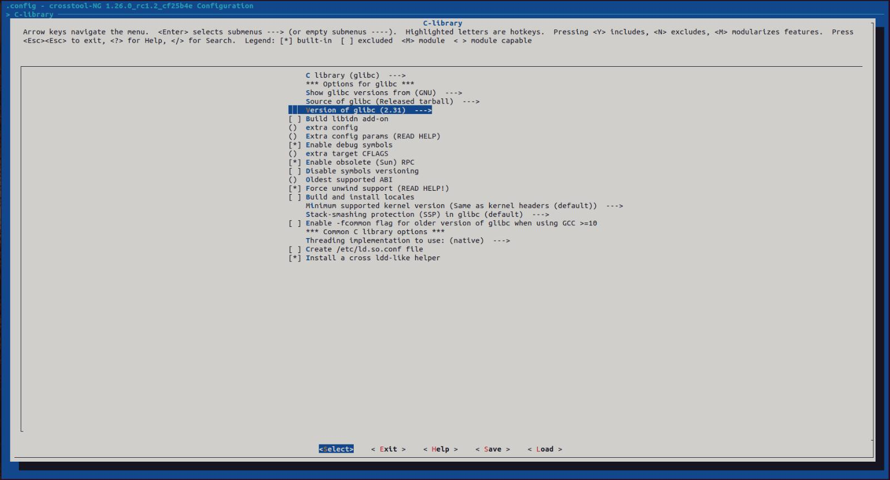
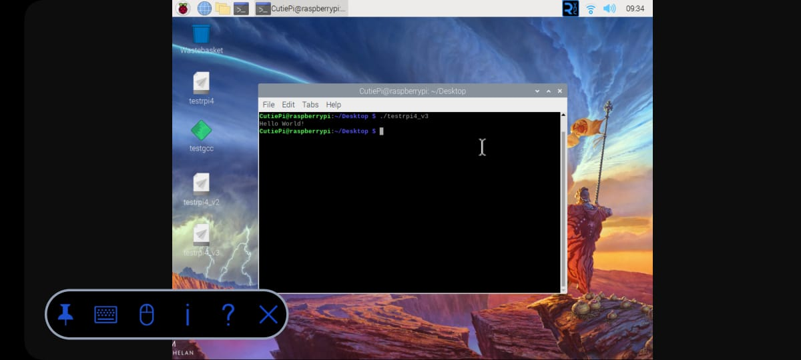

# Crosstool-NG_RPi4

This is a Raspberry Pi 4 cross toolchain built using Crosstool-NG. This README file shall contain all the steps I took in order to generate it and run the object file successfully on my Pi.

Notes:
  1. This toolchain was built on 1/9/2023. Some steps may differ/be omitted altogether. Please, bare in mind that Crosstool-NG is a piece of software that gets updated constantly and your steps may vary depending on when you decide to build/use Crosstool-NG.
  2. This toolchain was built on an Ubuntu 22.04 system on my trusty ten-year-old PC with the following specs:
        i7 4790k @4.4GHz
        16GB DDR3 RAM @2400MHz
        GTX 980ti (irrelevant to this project)
     Note that build time may vary depending on your hardware.
  3. The object file was tested on a Raspberry Pi 4 8GB RAM version running Raspbian OS Desktop (Bullseye). The OS version will become relevant later on to solve an issue I encountered.
  4. The source I followed is Chris Simmond's book "Mastering Embedded Linux Programming - Second Edition." It is a fantastic book that I STRONGLY recommend. But, bear in mind that some of the steps from this version are deprecated now---I know there is a 3rd edition but this is what I could get my hands on.

Now, with that out of the way, here is the whole thing in a nutshell:


## Installing Crosstool-NG

1. Make sure all your packages are up to date.
     ```
    sudo apt upgrade
    sudo apt update
    ```

2. Clone Crosstool-NG's Git repository. Make sure to clone it in the desired directory. In my case, I cloned it in Desktop.
   ```
   git clone https://github.com/crosstool-ng/crosstool-ng.git
   ```

4. After the process is done, change directory to crosstool-ng and see which branch is your repository on.
    ```
    cd crosstool-ng
    git status
    ```

5. Make sure you are on "master" and not any other branch. *This costed me over 90 minutes of work because I was on a deprecated branch.* If you were not on the master branch, switch to the master branch and then make sure you are on it.
    ```
    git checkout master
    git status
    ```
    

7. Execute the following commands in sequence. the `--enable-local` option means that the program will be installed into the current directory, which avoids the need for root permissions. After executing them, Crosstool-NG will be installed on your system and can be run from the repository folder. It can be run by typing `./ct-ng` from the repository's directory.
    ```
    ./bootstrap
    ./configure --enable-local
    make
    make install
    ```

Now, with Crosstool-NG ready, we can begin building our Raspberry Pi 4 toolchain.


## Building a toolchain for Raspberry Pi 4
   
1. Crosstool-NG comes with a list of sample configurations for different hardware architectures to make the process easier. Display all the options and choose the one suitable for our target hardware.
   ```
   ./ct-ng list-samples
   ```
   
   
   

3. The configuration made for Raspberry Pi 4 is `aarch64-rpi4-linux-gnu`. You can display its details using the command `./ct-ng show-aarch64-rpi4-linux-gnu`
   

4. Now, select this target configuration.
   ```
   ./ct-ng aarch64-rpi4-linux-gnu
   ```
   

5. The next few steps are INCREDIBLY important. They start by opening the configuration menu.
   ```
   ./ct-ng menuconfig
   ```
   
6. A step that is always the first thing to do is:
   Paths and Misc Options => Disable Render the Toolchain read-only
   
   

8. The next one can make or break your toolchain. Make sure to select a glibc version that is compatible with the system running on your target hardware: in my case, it is running Raspbian 11 with glibc version 2.31. *Not doing this step costed me over 3 hours until I configured it myself.*
   C-Library => Version of glibc => Choose 2.31
   
   

10. Now, the toolchain is read to be built. The building process took me between 22 and 23 minutes on a PC with the specs listed above. I ran it 3 times and the time varies by 10-20 seconds between builds.
   ```
   ./ct-ng build
   ```
   
   

The generated toolchain can be found in `~/x-tools/aarch64-rpi4-linux-gnu`.


And finally, what everyone is waiting for: writing code and cross-compiling it.

## Using the Toolchain

1. In order to use the cross compiler, add its directory to your path.
   ```
   PATH=~/x-tools/aarch64-rpi4-linux-gnu/bin:$PATH
   ```

2. I wrote a simple C program and compiled it. The generated object file can be run on the Pi without issues.
   ```
   aarch64-rpi4-linux-gnu-gcc test.c -o testrpi4_v3
   ```

3. The command `file` can be used to confirm that the object file has been cross compiled.
   

4. Now, to test it on my Pi. Notice that I use VNC because I am too lazy to buy a micro hdmi cable and I am screencasting it on my phone.
   


That's all folks!


   
